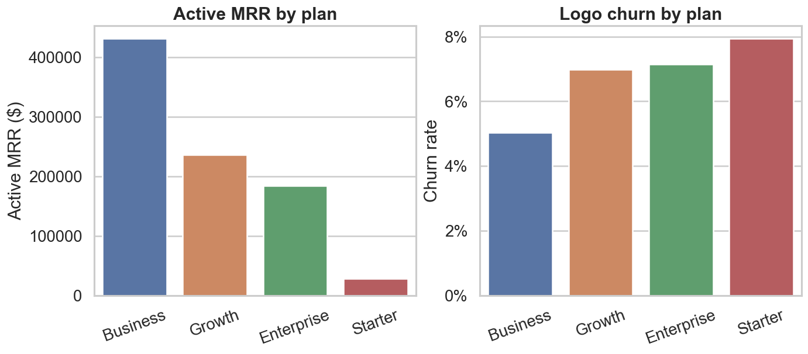
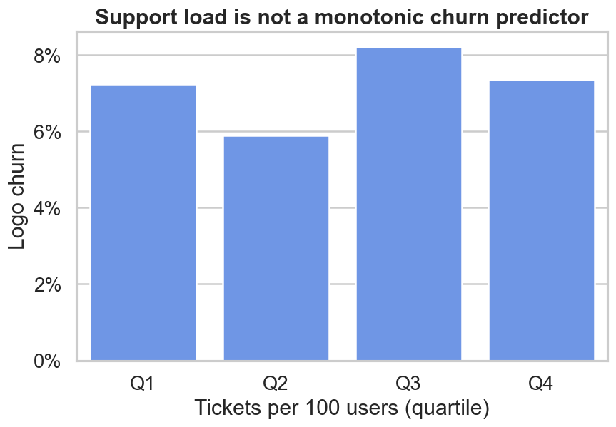

# SaaS Subscription Analytics

[](https://github.com/shahsuyog1985/saas-subscription-analytics/actions/workflows/ci.yml)

A reproducible, decision-oriented analysis of 1,200 B2B SaaS accounts. This
portfolio project turns five related source tables into an account-level mart,
tests the business rules, calculates core SaaS KPIs, and communicates what the
data does—and does not—support.

## Executive summary

The snapshot contains **1,030 active accounts**, **$879.5K active MRR** and a
**$10.55M ARR run rate**. Logo churn is **7.17%** and median licensed-seat
utilization is **76.9%**.

- Business accounts contribute **$431.3K**, or 49% of active MRR, with the
  lowest plan-level churn rate (5.03%).
- Enterprise is only 14 accounts but contributes **$184.1K active MRR**—a
  concentrated 21% of active MRR that merits high-touch retention.
- Starter has the highest plan-level churn (7.94%) and just **$28.5K active
  MRR**; broad, low-cost lifecycle interventions fit this segment better than
  expensive customer success coverage.
- Support load does **not** show a monotonic relationship with churn: churn by
  ticket-rate quartile is 7.24%, 5.90%, 8.22%, and 7.36%. Ticket volume alone is
  therefore a weak intervention trigger in this snapshot.
- Invoice collection is **89.87% by invoice count**, while open tickets are
  **8.41% of all tickets**.





## Business questions

1. Which plans drive recurring revenue and where is logo churn concentrated?
2. Is support demand associated with churn strongly enough to guide outreach?
3. How much licensed capacity is actually used across plans?
4. Which signup cohorts remain active at the snapshot date?
5. How effectively are invoices collected?

## KPI definitions

| KPI | Definition |
|---|---|
| Active MRR | Sum of `mrr` for subscriptions whose status is `active` |
| ARR run rate | Active MRR × 12; not recognized annual revenue |
| Active ARPA | Active MRR ÷ active accounts |
| Logo churn | Churned subscriptions ÷ all subscriptions at the snapshot |
| Seat utilization | Users linked to an account ÷ licensed seats |
| Invoice collection | Paid invoices ÷ all invoices, by count |
| Cohort retention | Active accounts ÷ accounts in each signup quarter |
| Support load | Tickets per 100 linked users |

### Important analytical boundary

This is a current-state subscription table, not a subscription event ledger. It
does not record upgrades, downgrades, expansions, or historical opening MRR.
Consequently, **true GRR and NRR cannot be calculated defensibly**. Likewise,
the cohort chart is snapshot retention, not a time-since-signup survival curve.
These are deliberate exclusions, not missing dashboard tiles.

## Reproduce the project

Requires Python 3.10+.

```bash
python -m venv .venv
# Windows: .venv\Scripts\activate
# macOS/Linux: source .venv/bin/activate
python -m pip install -r requirements-dev.txt
python scripts/download_data.py
python -m pytest
python -m src.analysis
```

Outputs are written to `reports/tables/` and `reports/figures/`. The downloader
pins the source archive SHA-256, while tests verify row counts, keys, foreign
keys, status/end-date consistency, seat capacity, and the plan pricing rule.

## Repository structure

```text
.
├── .github/workflows/ci.yml   # lint, tests, analysis, artifact upload
├── data/                      # documentation + ignored raw downloads
├── reports/                   # portfolio-ready figures and result tables
├── scripts/                   # deterministic download and cleanup
├── src/                       # loading, validation, metrics, analysis
└── tests/                     # data-contract and KPI tests
```

## Method

The pipeline validates the five-table relational model and builds one row per
account by joining subscription state with aggregated users, invoices, and
support tickets. Segmentation is performed by plan, industry, signup cohort,
and support-load quartile. Calculations live in small, testable functions rather
than a notebook, making the project straightforward to review and automate.

## Limitations

- Synthetic CC0 data is useful for demonstrating analytical reasoning, not for
  estimating a real company's performance.
- Subscription state has no explicit as-of timestamp; results should be treated
  as one fixed snapshot.
- Invoice collection is measured by count, not aging or amount-weighted recovery.
- Associations are descriptive and do not establish causality.

## Data source and license

The dataset is published by [Misata Studio](https://www.misata.studio/datasets/saas-subscription-analytics)
under CC0. The source advertises 44,384 rows across five tables and supplies an
integrity certificate. Raw CSVs remain outside Git and are recreated with the
download script. Project code is MIT licensed.

## Publishing to your own GitHub repository

1. Update the CI badge if you fork the project under a different GitHub username.
2. Create an empty GitHub repository named `saas-subscription-analytics` (do not
   initialize it with a README or license).
3. From this directory, run:

```bash
git init
git add .
git commit -m "Build reproducible SaaS subscription analytics portfolio"
git branch -M main
git remote add origin https://github.com/shahsuyog1985/saas-subscription-analytics.git
git push -u origin main
```

4. Open the Actions tab and confirm the CI workflow passes. Generated report
   outputs are also retained as a downloadable workflow artifact.

Before `git add`, `git status --short` should show no files under `data/raw/`.
